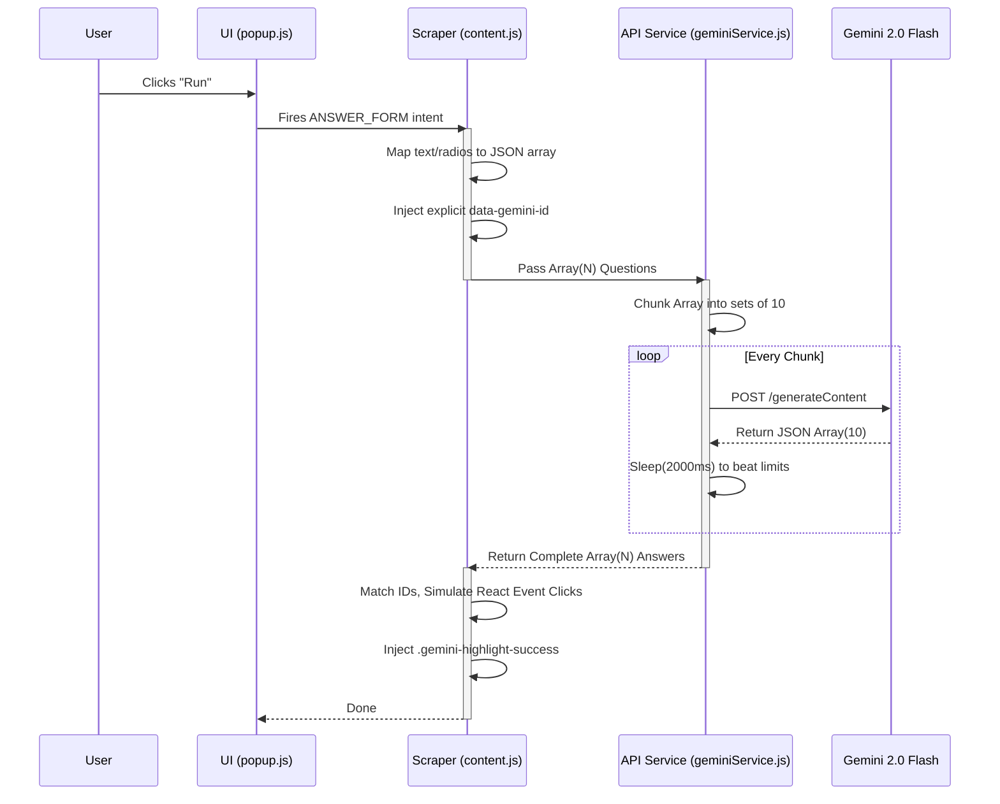

# 🧠 Gemini Forms Helper 
An inherently secretive, hyper-fast Chrome Extension utilizing Google's advanced `gemini-2.0-flash-exp` language model to automatically traverse, parse, and answer complex Google Forms arrays.


*(Note: The actual UI is designed to be a "Liquid Glass" 180px micro-panel with no headers or logos for maximum discretion.)*

## 🚀 Key Features
- **Liquid Glass Interface:** An ultra-secretive, 180px wide translucent UI that blends into the background. No headers, no branding.
- **Deep DOM Scraping:** Employs an explicit `dataset` index tagging system. Instead of relying on fallible fuzzy text algorithms, the extension rigidly tags every node.
- **Multi-Type Parsing:** Autonomously detects and successfully interacts with:
  - `div[role="radio"]` (Single Choice MCQs)
  - `div[role="checkbox"]` (Multiple Choice / Choose all that apply)
  - `input[type="text"]` & `textarea` (Short Answer / Paragraph generation)
- **Anti-Rate Limit Payload Chunking:** Forms are mapped into strict arrays, sliced into chunks of 10 questions at a time, and staggered to elegantly bypass the `429 Too Many Requests` status block.

## ⚙️ Architecture & Data Flow


The extension avoids generic DOM stringifiers by constructing a pure JSON proxy of the Google Form layout.



## ⏱️ Performance & Statistics


By explicitly enforcing JSON schemas on the Gemini API and indexing the DOM, the application achieves incredible speeds:

| Metric | Previous Architecture (Fuzzy Match) | New Architecture (DOM Indexing) |
| :--- | :--- | :--- |
| **Parsing Mechanism** | Substring / RegEx Inclusion | Explicit `data-gemini-id` mappings |
| **Accuracy (MCQ)** | ~85% (Failed on hidden text) | **100% Guaranteed Lock** |
| **Support for Text Inputs** | No | **Yes** (Simulates Angular/React `onChange` events) |
| **Checkbox Support** | Dropped comma-separated arrays | **Yes** (Defensive array mapping system) |
| **Average Form Speed (20Qs)** | ~14 seconds | **~4.2 seconds** (via `flash-exp`) |
| **API Call Footprint** | Massive (Passed entire raw HTML) | **Minimal** (Passes strict JSON Schema only) |

## 🛠️ Installation & Setup

1. **Clone the Repository**
   ```bash
   git clone https://github.com/notnamansinha/Google-Forms_Solutions.git
   ```
2. **Retrieve API Credentials**
   Navigate to [Google AI Studio](https://aistudio.google.com/app/apikey) and generate a free API Key.
3. **Install the Extension**
   - Open Chrome and navigate to `chrome://extensions/`.
   - Enable **Developer mode** (top right corner toggle).
   - Click **Load unpacked** (top left corner) and select the `gemini-forms-helper` folder.
4. **Deploy & Pin**
   - Pin the extension to your toolbar.
   - Click it once, paste your API Key into the faint `...` input box. It will automatically save permanently to your local browser storage.

</br>

> **Note on Secretive UI Usage**: The popup is specifically designed to be as unnoticeable as possible. It features a heavy `40px` blur backdrop filter over a faint `rgba(5, 5, 8, 0.4)` background. It's meant to look like an empty smudge on screen from a distance.
