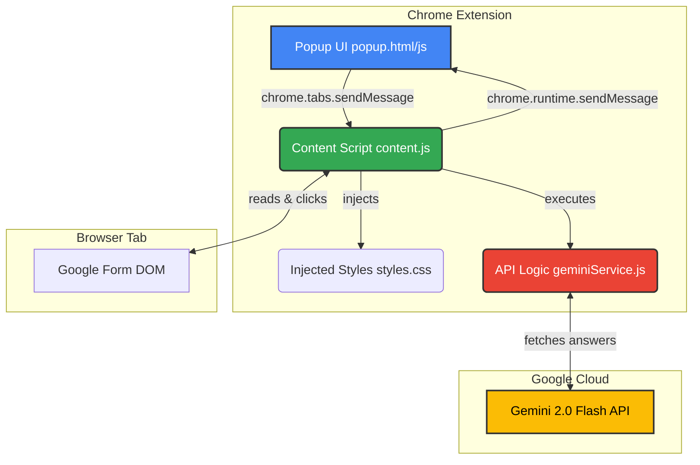

# Gemini Forms Helper 

An AI-powered Chrome extension that automatically reads Google Forms (Multiple Choice Questions and Checkboxes), fetches the correct answers using the Gemini 2.0 Flash API, and auto-selects them for you.

## Architecture

The extension follows a standard Chrome Manifest V3 architecture with messaging between the popup and the content script injected into the active form page.



1. **Popup UI (`popup.html` & `popup.js`)**: A strict Black & White, Apple HIG-compliant control panel where users securely store their Gemini API key. Uses `chrome.storage.local` to persist the working state even if the popup is closed.
2. **Content Script (`content.js`)**: Injected directly into the `https://docs.google.com/forms/*` page. It grabs the full page text, passes it to the Gemini service, and later fuzzy-matches the API JSON response to the DOM nodes to simulate click events.
3. **Gemini Service (`geminiService.js`)**: Uses a robust chunking algorithm to split large forms into 150-line blocks. It sequentially calls `gemini-2.0-flash-exp` (falling back to other models on 429) to safely generate JSON without hitting token/rate limits.

## Installation (Developer Mode)

Since this extension is not currently on the Chrome Web Store, you can install it manually:

1. Clone or download this repository.
   ```bash
   git clone https://github.com/notnamansinha/Google-Forms_Solutions.git
   ```
2. Open Google Chrome and navigate to `chrome://extensions/`.
3. Toggle **Developer mode** ON in the top right corner.
4. Click **Load unpacked** in the top left corner.
5. Select the cloned `gemini-forms-helper` folder. 
6. Pin the extension to your toolbar for easy access!

## How to Use

1. **Get an API Key**: Go to [Google AI Studio](https://aistudio.google.com/app/apikey) and generate a free API Key.
2. **Save the Key**: Click the extension icon in your Chrome toolbar, paste your API Key into the input field, and it will be saved securely to your local browser storage.
3. **Open a Form**: Navigate to any standard Google Form that contains multiple-choice questions or checkboxes.
4. **Auto-Answer**: Click the extension icon and hit the **"Answer Form"** button.
5. **Review**: The extension will scrape the form, consult Gemini, and highlight the selected correct answers in a green border. You can review them before submitting the form.
6. **Clear**: If you want to reset everything, click the **"Clear Selections"** button in the popup to uncheck all answers.

## ⚙️ How it Works under the hood
- **Scraping**: Instead of parsing DOM trees manually, it pulls the `innerText` of the entire form area and splits it into manageable 150-line chunks for the LLM to parse.
- **Fuzzy Matching**: Gemini sometimes returns slightly modified text. The application uses a scoring system to fuzzy-match the returned exact answer with the closest DOM element text (`aria-label` or `data-value`).
- **Resilient Polling**: The popup queries `chrome.storage.local` every 1000ms. You can close the popup while it works and reopen it to see the exact current status.

## Notes & Edge Cases
- Currently supports standard single-choice (radio) and multiple-choice (checkbox) options.
- Dropdowns and short/long answer text inputs are ignored in the current version.
- Exceptionally long forms are protected from `429` (Rate Limit) errors via the internal chunking system and automatic model roll-overs (`gemini-2.0-flash-exp` -> `lite` -> `flash`).
